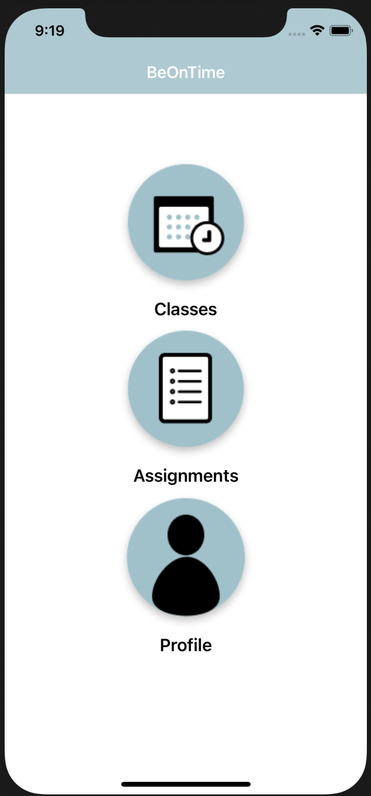
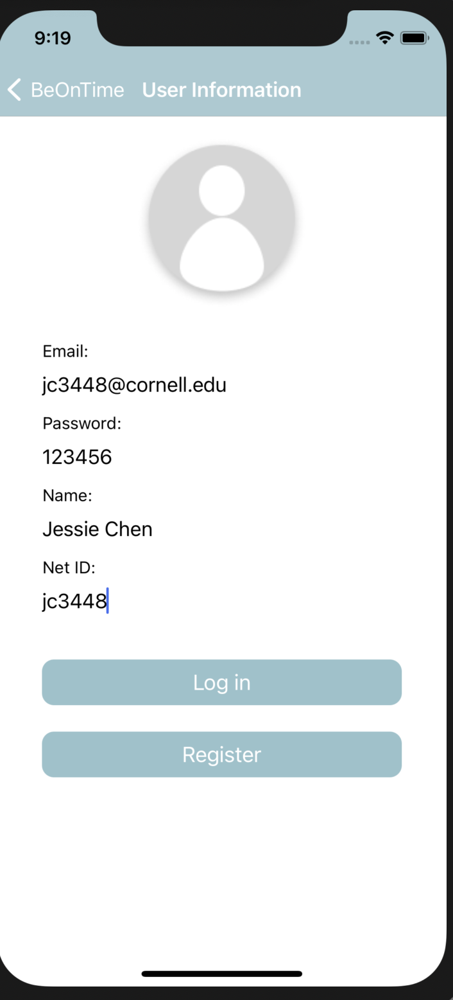
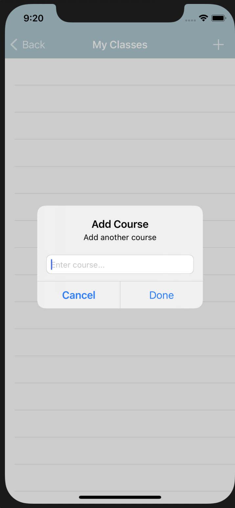
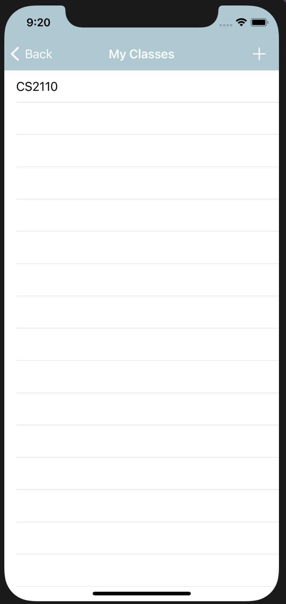
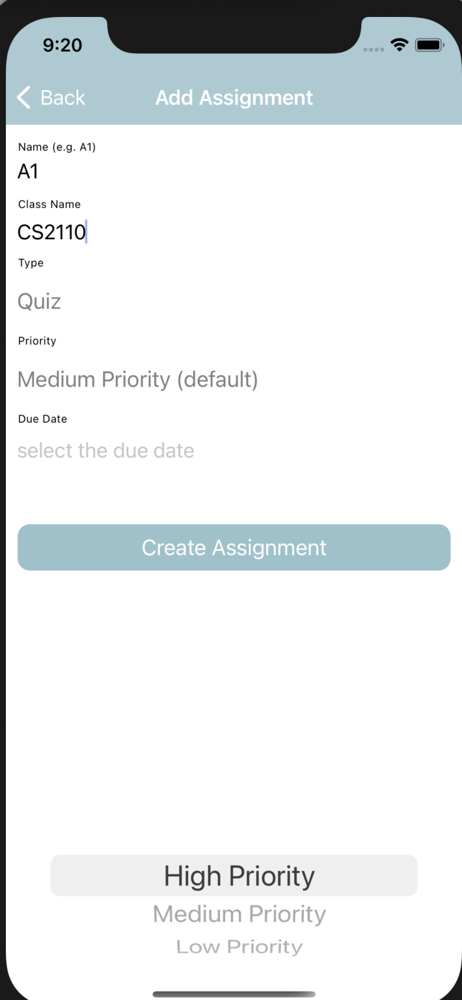
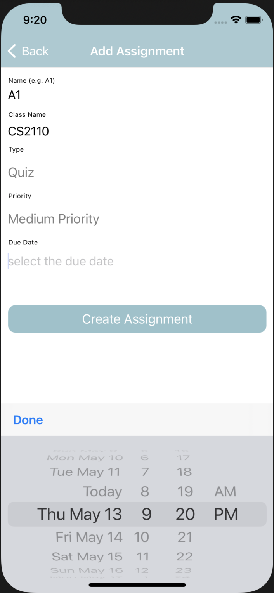
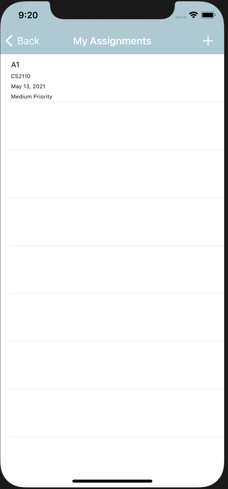

# BeOnTime
Helping students be on time in their courses!

Repository for the app BeOnTime, by Jessie Chen, Miranda Luo, Miranda Medina, and Coco Xu for the Cornell AppDev challenge.

**Design**: Miranda Medina

**iOS**: Jessie Chen

**Backend**: Miranda Luo, Coco Xu

## Description/Overview
This app is meant for students of Cornell University to keep track of assignments and due dates for their courses in school. Students can add courses from the class roster, and add assignments to their classes and their due dates. They can also track if the assignments are done or not.

### Features
- authentication (register/login)
    - the courses and assignments added are associated with the currently logged in user
- adding courses
- deleting courses
- viewing courses
- adding assignments
- viewing assignments
- marking assignments as done

### Screenshots

#### Figma Design
[Here](https://www.figma.com/file/EcvXbDWQLv45ku3qQ4iYFR/BeOnTime-Mockup?node-id=0%3A1
) is the design markup.

## iOS Information

iOS code is in the "iOS" folder.

### Requirements Satisfied
- **Layout**: NSLayoutConstraint for everything
- **Navigation**: pushViewController for each button on the home page, pushViewController for each cell in the courseTableCellView and the assignmentTableCellView.
- **UITableView**: Two UITableViews, one for courses and one for assignments
- **API**: for login & register page (.post method), add courses(.post method)

## Backend Information

The backend is hosted at the URL http://beontimeapp.herokuapp.com/

View the **API documentation** [here](https://documenter.getpostman.com/view/14753301/TzRUA75X). 

**Note**: not all of the endpoints were used in the final iOS implementation, and two authentication endpoints, `/session/` and `/secret/`, were not documented.

### Requirements Satisfied
- **Four endpoints**: There are a total of 21 endpoints (two undocumented): three are for getting info from the Class Roster API, five are course specific, nine are assignment specific, and four are authentication specific (two undocumented).
- API Specification: See above, or [here](https://documenter.getpostman.com/view/14753301/TzRUA75X).
- Relational Database schema: We used SQLAlchemy ORM with a SQLite database. We have three models, `Course`, `Assignment`, and `User`. They only have one-to-many relationships, given the specifications of this app.
- Heroku deployment: See above, or [here](http://beontimeapp.herokuapp.com/).
